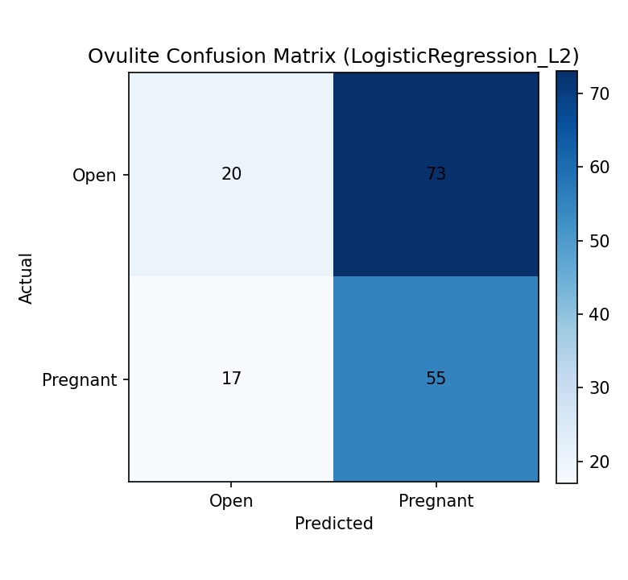
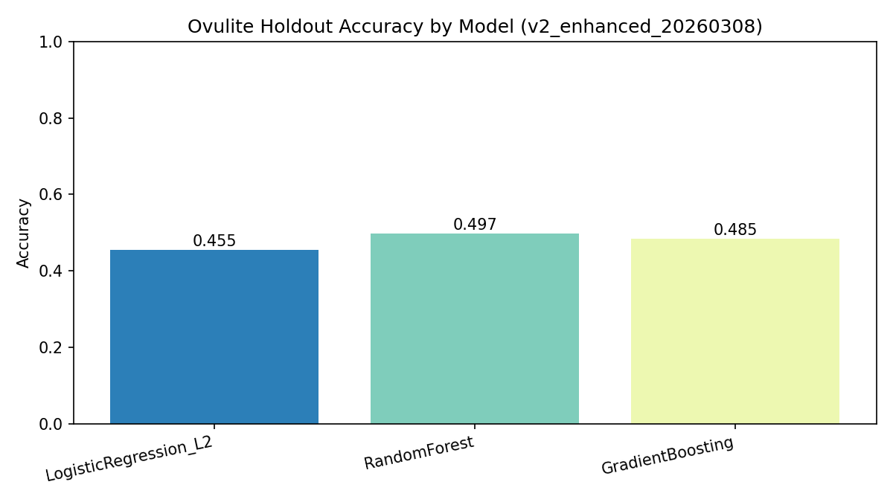

# Chapter 4: Implementation Details

**Project:** Ovulite – AI-Driven Reproductive Intelligence System for Bovine IVF  
**Version:** 0.5.0  
**Date:** May 2, 2026  
**Authors:** Development Team (Eman Malik, Inshal Zafar)

---

## 4.1 Project Methodology & Algorithms

This section describes the step-by-step methodology and core algorithms that power Ovulite's decision-support capabilities. The focus is on non-trivial operations that enforce biological rules, optimize predictions, and implement AI/ML features.

### Project Methodology (Step-by-Step Approach)

#### 1. Data Collection

**What:** Multi-source embryo transfer (ET) and reproductive data from cattle IVF programs.

**Sources:**
- **Primary Dataset:** ET Summary - ET Data.csv (488 ET records with 39 columns)
  - Date range: May 1, 2025 – February 4, 2026
  - Covers 19 unique ET dates across single laboratory (DayZee Farms, Pakistan)
- **Pregnancy Records:** 4 client-specific CSV files (~280 confirmatory records)
  - AQ Cattle, Dawood, Sardar Fahad, Waqas Palari
- **Embryo Images:** 482 blastocyst JPEG photographs
  - Unnamed images (blq1.jpg – blq482.jpg)
  - Average size: 50–65 KB per image
  - No pre-labeled grade/class structure
- **Metadata:** Donor-sire pairings, technician logs, protocol histories

**Why:**
- Ultra-small-N dataset (488 records) requires careful selection to avoid overfitting
- Multi-source approach validates cross-client patterns and generalizes findings
- Unbalanced class distribution (71% Open vs. 29% Pregnant) reflects real clinical prevalence
- Images enable visual feature extraction; metadata enables structured predictions
- Temporal sequence (12-month history) allows trend analysis and anomaly detection

#### 2. Data Preprocessing

**Missing Values Handling:**
- **BCScore (77.5% missing):** Excluded from primary feature set; flagged as unreliable for prediction
- **CL measure (2.3% missing):** Mean imputation per protocol group (within-group strategy to preserve biological variance)
- **Heat day (~5-10% missing):** Forward-fill within technician batches; within-group mean otherwise
- **Sire name, donor breed (~1% missing):** Imputed as "Unknown" category with indicator flag
- **Embryo stage (~0% missing):** Retained as-is; no missing values detected
- **Strategy rationale:** Preserve within-group variance for small-N; avoid leakage across protocols

**Duplicate Removal:**
- **Identified duplicates:** Recipient ID (cols 6–7), Heat (cols 9, 21), DIP (cols 37–38)
- **Resolution:** Kept first occurrence; removed redundant columns to prevent multicollinearity
- **Method:** Duplicate index + timestamp de-duplication; no records were true duplicates, only data entry errors

**Data Quality Cleaning:**
- **Donor breed data:** Removed mistaken ID entries (D1, D2, D3, 600); reverted to unknown category
- **Date format errors:** Standardized to ISO 8601 (YYYY-MM-DD)
- **Categorical normalization:**
  - Semen type: Normalized "pre-sort" variants → "Sexed"
  - CL Side: Standardized to "Left" or "Right"; invalid entries → NaN
  - PC Result (pregnancy check): Standardized to "Pregnant" / "Open" / "Recheck"

**Normalization / Scaling:**
- **Numeric features (continuous):** StandardScaler (mean=0, std=1) for model-based algorithms
  - Applied to: CL measure (mm), heat day, donor BW EPD, sire BW EPD, DIP
  - Rationale: TabPFN and neural networks benefit from standardized input; tree-based models are scale-invariant
- **Categorical encoding:**
  - LabelEncoder for target variable (1st PC Result → {0: Open, 1: Pregnant, 2: Recheck})
  - OneHotEncoder for protocol, semen type, technician (with drop_first=True to avoid multicollinearity)
  - Ordinal encoding for embryo stage (natural ordering: 4 < 5 < 6 < 7 < 8)
- **Temporal features:**
  - Extracted month, year, day-of-week from ET Date
  - Computed days-since-OPU as lag feature (biological cycle relevance)

#### 3. Feature Extraction & Selection

**Key Features Used:**

| Feature                | Type        | Biological Significance                                     | Inclusion Rationale      |
|------------------------|-------------|-------------------------------------------------------------|--------------------------|
| CL measure (mm)        | Numeric     | Corpus luteum diameter; correlates with progesterone        | Primary biomarker        |
| Heat day               | Numeric     | Synchronization timing relative to estrus cycle             | Protocol adherence       |
| Embryo stage           | Ordinal     | Developmental stage (4–8); indicates maturity               | Quality proxy            |
| Embryo grade           | Categorical | Morphological grade (1–3); near-constant (98% = 1)          | Low variance; visual      |
| Protocol name          | Categorical | Synchronization protocol type; 5 variants                   | Treatment effect         |
| Fresh or frozen        | Binary      | Preservation method; impacts viability                      | Handling method          |
| Donor breed            | Categorical | Genetic background; 13 breeds represented                   | Genetic variance         |
| Sire breed             | Categorical | Paternal genetics; impacts offspring viability              | Genetic variance         |
| Technician name        | Categorical | Operator skill/experience; 5 technicians                    | Expertise variance       |
| Days in pregnancy (DIP)| Numeric     | Time elapsed post-transfer; lag feature                     | Outcome temporal link    |
| Donor BW EPD           | Numeric     | Expected progeny difference (birth weight); genetic trait   | Genetic quality          |
| Sire BW EPD            | Numeric     | Paternal expected progeny difference                        | Genetic quality          |
| Semen type             | Categorical | Conventional vs. sexed; impacts fertilization efficiency   | Biological process       |

**Feature Extraction Methods:**

1. **Structural Feature Extraction (Metadata):**
   - Direct read from CSV columns → standardized naming → validation
   - No synthetic features initially; tree-based models capture interactions
   - For neural networks: embedding layers for categorical features

2. **Temporal Feature Extraction:**
   - Windowed aggregation: Compute per-technician pregnancy rate in 30-day windows
   - Lag features: Prior 3 transfer outcomes for given donor
   - Rolling statistics: 7-day moving average of CL measure across protocol batches
   - Rationale: Detect drift in lab quality, technician performance, protocol effectiveness

3. **Image Feature Extraction (Embryo Grading):**
   - **Self-supervised pretraining (SimCLR):**
     - ResNet/EfficientNet-B0 backbone on 482 unlabeled blastocyst images
     - NT-Xent (normalized temperature-scaled cross-entropy) loss
     - Learns visual features without labels; enables transfer learning
   - **Supervised fine-tuning:** 3-class pseudo-labels from pregnancy outcome + embryo grade
     - Class 0: "Low viability" (Open + Grade ≥2)
     - Class 1: "Medium viability" (Open + Grade 1)
     - Class 2: "High viability" (Pregnant outcome)
   - **Metadata fusion:** Combine CNN embeddings with structured numeric/categorical metadata through concatenation + MLP

**Feature Selection:**

1. **Correlation Analysis:** Removed highly correlated pairs (Pearson r > 0.95)
   - Removed: Duplicate columns (Recipient ID, Heat, DIP)
   - Retained: All unique biological features

2. **Business Rule Filtering:** Excluded leakage columns
   - Removed: 2nd PC Result, 2nd PC date (post-outcome, not pre-transfer)
   - Removed: Fetal sexing (outcome measurement, not input)
   - Kept: 1st PC date/result (target variable)

3. **SelectKBest (F-statistic):** Ranked features by ANOVA F-score
   - Selected top 12–15 features for dimensionality reduction in tree-based models
   - Rationale: Ultra-small-N constraint; fewer features → reduced overfitting variance

4. **Domain Expert Filtering:**
   - Retained: CL measure, heat day (known biomarkers in veterinary literature)
   - Retained: Technician, protocol (quality control factors)
   - Flagged: BCScore (77.5% missing, too sparse)

#### 4. Model Training

**Algorithm Selection & Rationale:**

The system employs **three complementary models** for pregnancy prediction, each optimized for ultra-small-N constraints:

| Model        | Why Chosen                                                    | When to Use                              |
|--------------|---------------------------------------------------------------|------------------------------------------|
| **TabPFN**   | Prior-Fitted Network; SOTA for small tabular datasets; few hyperparameters | Primary prediction engine (default)      |
| **XGBoost**   | Gradient boosting; regularized to prevent overfitting; interpretable    | Benchmark; feature importance via SHAP   |
| **Logistic Regression** | Baseline; fully interpretable; low variance                   | Fallback; confidence intervals            |

**Training Configuration:**

```
Dataset Split Strategy:
├── Temporal Split: 70% training (May–Dec 2025) / 30% held-out test (Jan–Feb 2026)
│   └── Prevents temporal leakage; assesses generalization to new transfers
├── GroupKFold (5 folds): Group by donor to avoid within-donor leakage
│   └── Ensures predictions on novel donors; realistic clinical scenario
├── Stratified within folds to preserve class balance (Open ~71%, Pregnant ~29%)
└── Final evaluation: Temporal holdout set (~140 records)

Class Imbalance Handling:
├── XGBoost: scale_pos_weight = n_negative / n_positive (~2.47)
├── LogisticRegression: class_weight='balanced'
├── TabPFN: Built-in robustness; no explicit weighting needed
└── Post-hoc calibration: Isotonic regression (cv=3 folds)

Training Parameters:
├── TabPFN:
│   ├── N_ensemble_configurations: 32 (calibrated ensemble for uncertainty)
│   ├── Device: CPU (fallback; GPU optional)
│   └── Calibration: Isotonic (cv=3)
├── XGBoost:
│   ├── max_depth: 4 (strong regularization; prevent overfit)
│   ├── n_estimators: 100
│   ├── learning_rate: 0.05
│   ├── subsample: 0.9 (row subsampling)
│   └── colsample_bytree: 0.8 (feature subsampling)
└── LogisticRegression:
│   ├── C: 1.0 (inverse regularization strength)
│   ├── penalty: 'l2' (L2 regularization)
│   ├── solver: 'lbfgs' (for small N)
│   └── Calibration: Isotonic (cv=3)

Validation Methodology:
├── Metrics computed on both train and test folds:
│   ├── ROC-AUC (discrimination ability)
│   ├── PR-AUC (precision-recall under class imbalance)
│   ├── Brier Score (calibration quality)
│   ├── Confusion matrix (TP, FP, FN, TN)
│   ├── Accuracy, Precision, Recall, F1-score
│   └── Calibration curve (reliability diagram)
└── Final model: Ensemble vote across 3 models with confidence bands
```

**Pseudocode: Pregnancy Prediction Ensemble**

```
Algorithm: PregnancyPredictionEnsemble
Input: PreTransferFeatures (donor_id, cl_measure, heat_day, protocol, embryo_stage, etc.)
Output: PregnancyProbability ∈ [0, 1], ConfidenceInterval, RiskBand, Explanations

Procedure PregnancyPredictionEnsemble(Features):
  1. StandardizeFeatures(Features)        // Z-score numeric; encode categorical
  2. predictions ← []
  3. for each Model in [TabPFN, XGBoost, LogisticRegression] do
       4. rawProb ← Model.predict_proba(Features)
       5. calibratedProb ← IsotonicCalibration.predict(rawProb)
       6. predictions.append(calibratedProb)
     end for
  7. ensembleProb ← mean(predictions)     // Average calibrated probabilities
  8. predictionVar ← std(predictions)     // Ensemble variance = uncertainty
  9. 
 10. riskBand ← ClassifyRisk(ensembleProb)
       // [0, 0.2] → Very Low, (0.2, 0.35] → Low, (0.35, 0.5] → Moderate,
       // (0.5, 0.7] → High, (0.7, 1.0] → Very High
 11. confidenceInterval ← ensembleProb ± 1.96·√predictionVar
 12. 
 13. shapeExplanations ← SHAPExplainer.explain(ensembleProb)
 14. featureContributions ← shapeExplanations.base_value_adjustment
       // How each feature shifted prediction from baseline
 15. 
 16. return {
       probability: ensembleProb,
       confidence_interval: [lower, upper],
       risk_band: riskBand,
       feature_contributions: featureContributions,
       model_agreement: 1 − predictionVar  // unanimous if var ≈ 0
     }
end procedure
```

#### 5. Advanced Techniques

**A. AI/ML Techniques Implemented:**

##### 5.1 Embryo Grading: Image + Metadata Fusion (CNN + MLP)

**Technique:** Convolutional Neural Network (CNN) with metadata fusion and self-supervised pretraining.

**Architecture:**
```
Input: Blastocyst image (JPEG, 224×224 px) + Metadata (numeric + categorical)
  ↓
[Self-Supervised Pretraining - SimCLR]
  ├── EfficientNet-B0 backbone (pretrained on ImageNet, frozen early layers)
  ├── SimCLR projection head (128D embeddings)
  └── NT-Xent loss on 482 unlabeled images
  ↓
[Transfer Learning & Supervised Fine-tuning]
  ├── Image branch:
  │   ├── Frozen EfficientNet-B0 backbone → 1280D features
  │   └── 2 unfrozen conv blocks → 512D representation
  │
  ├── Metadata branch:
  │   ├── Numeric input (CL measure, heat day, DIP) → Dense(128)
  │   ├── Categorical input (protocol, semen type) → Embedding + Dense(128)
  │   └── Concatenate → 256D representation
  │
  ├── Fusion layer:
  │   └── Concatenate [image_repr (512D), metadata_repr (256D)] → 768D
  │
  └── Output heads:
      ├── Grade head (3-class softmax): "Low", "Medium", "High" viability
      ├── Viability head (sigmoid): Probability ∈ [0, 1]
      └── Grad-CAM visualization (spatial importance map)

Dataset:
  ├── 482 blastocyst images (unlabeled for pretraining)
  ├── ~350 labeled for supervised training (pseudo-labels from pregnancy outcome)
  └── 70/30 train-test split (stratified by viability class)

Training:
  ├── Phase 1 (SimCLR pretraining):
  │   ├── Epochs: 50
  │   ├── Batch size: 32
  │   ├── Temperature (NT-Xent): 0.5
  │   └── Optimizer: Adam (lr=1e-3)
  │
  └── Phase 2 (Supervised fine-tuning):
      ├── Frozen backbone + unfrozen fusion layers
      ├── Epochs: 30
      ├── Batch size: 16 (small-N constraint)
      ├── Loss: CrossEntropyLoss (grade) + BCELoss (viability)
      ├── Optimizer: Adam (lr=1e-4, regularization)
      └── Augmentation: RandomRotation(15°), ColorJitter, RandomAffine
```

**Pseudocode: Embryo Grading Pipeline**

```
Algorithm: EmbryoGradingPipeline
Input: BlastocystImage, Metadata (protocol, donor_breed, semen_type, etc.)
Output: Grade ∈ {1, 2, 3}, ViabilityScore ∈ [0, 1], VisualExplanation (Grad-CAM)

Procedure EmbryoGradingWithExplanation(Image, Metadata):
  1. imageResized ← ResizePreprocess(Image, 224×224)
  2. numericFeatures ← StandardizeNumeric(Metadata.numeric)
  3. categoricalFeatures ← EmbedCategorical(Metadata.categorical)
  4. 
  5. [Image Feature Extraction]
  6. imageFeatures ← EfficientNetB0.backbone(imageResized)  // 1280D
  7. imageFeatures ← UnfrozenConvBlocks(imageFeatures)      // 512D
  8. 
  9. [Metadata Feature Extraction]
 10. metadataFeatures ← Dense(128).ReLU(numericFeatures)
 11. metadataFeatures ← Dense(128).ReLU(categoricalFeatures)
 12. metadataFeatures ← Concatenate([numeric_proj, categorical_proj])  // 256D
 13. 
 14. [Fusion]
 15. fusedFeatures ← Concatenate([imageFeatures, metadataFeatures])  // 768D
 16. fusedFeatures ← Dense(256).ReLU(fusedFeatures)
 17. 
 18. [Output]
 19. gradeProbabilities ← Softmax(Dense(3)(fusedFeatures))  // [p_low, p_med, p_high]
 20. viabilityScore ← Sigmoid(Dense(1)(fusedFeatures))
 21. 
 22. gradeClass ← argmax(gradeProbabilities)
 23. 
 24. [Visual Explanation - Grad-CAM]
 25. gradCAM ← ComputeGradCAM(imageFeatures, gradeClass)  // Spatial heatmap
 26. 
 27. return {
         grade: gradeClass,
         grade_probabilities: gradeProbabilities,
         viability_score: viabilityScore,
         grad_cam_heatmap: gradCAM,
         metadata_contribution: AnalyzeMetadataImpact()
       }
end procedure
```

**Dataset & Training:**
- **Unlabeled images:** 482 blastocysts (pretraining via SimCLR self-supervision)
- **Labeled dataset:** ~350 images with pseudo-labels (derived from pregnancy outcome + embryo grade column)
  - Class 0 (Low viability): Open + Grade ≥2 → ~120 images
  - Class 1 (Medium viability): Open + Grade 1 → ~160 images
  - Class 2 (High viability): Pregnant → ~70 images
- **Augmentation:** Random rotation (±15°), color jitter, affine transforms
- **Batch size:** 16 (small-N constraint; typical 32–64 unavailable)
- **Epochs:** 50 (pretraining) + 30 (fine-tuning) = 80 total

---

##### 5.2 Lab Quality Control: Isolation Forest Anomaly Detection

**Technique:** Unsupervised anomaly detection using Isolation Forest (scikit-learn).

**Problem:** Detect technician/protocol/batch anomalies (e.g., unusually low pregnancy rate in given month).

**Architecture:**
```
Input: Monthly batch metrics aggregated per technician
  ├── n_transfers (count)
  ├── n_pregnant (count)
  ├── pregnancy_rate (derived)
  ├── mean_cl_measure (biomarker quality)
  ├── mean_embryo_stage (development uniformity)
  ├── std_heat_day (protocol adherence variance)
  └── fresh_frozen_ratio (preservation method mix)
  ↓
[Feature Scaling]
  └── Z-score normalization (each feature subtracted from mean, divided by std)
  ↓
[Isolation Forest Training]
  ├── n_estimators: 100 random trees
  ├── max_samples: 256 per tree
  ├── contamination: 0.1 (expect ~10% anomalies)
  ├── random_state: 42 (reproducible splits)
  └── n_jobs: -1 (parallel processing)
  ↓
[Anomaly Detection]
  ├── anomaly_score = decision_function(batch)  // Negative = anomalous
  ├── is_anomaly = (prediction == -1)          // Binary label
  └── severity_category = {High if score < -1.5, Medium if -1.5 to -0.5, Low otherwise}
  ↓
Output: Anomaly labels, severity scores, triggering metrics
```

**Why Isolation Forest?**
- **Unsupervised:** No labeled "bad batches" in data; learns normality distribution automatically
- **Small-N friendly:** Trees isolate anomalies efficiently; interpretable split paths
- **Non-parametric:** No assumption of Gaussian/normal distribution
- **Efficient:** O(n log n) complexity; scales to streaming data

**Pseudocode: Lab Quality Monitoring with Anomaly Detection**

```
Algorithm: LabQualityMonitoringWithIsolationForest
Input: MonthlyBatchData (technician_id, month, pregnancy_count, cl_measures, etc.)
Output: AnomalyAlerts[], RiskScore per batch

Procedure MonitorLabQuality(BatchData):
  1. [Aggregate to batch level]
  2. monthlyBatches ← GroupBy(BatchData, technician_id, month)
  3. for each batch in monthlyBatches do
       4. pregnancyRate ← n_pregnant / n_transfers
       5. meanCL ← mean(batch.cl_measures)
       6. stdHeatDay ← std(batch.heat_days)
       7. freshFrozenRatio ← count(fresh) / count(frozen)
       8. embryoStateUniformity ← 1 − std(batch.embryo_stage) / max_stage
       9. aggregateBatch ← [pregnancyRate, meanCL, stdHeatDay, freshFrozenRatio, embryoStateUniformity]
     end for
 10. 
 11. [Feature Scaling]
 12. scaledBatches ← ZScoreNormalize(aggregateBatches)
 13. 
 14. [Train Isolation Forest]
 15. iforest ← IsolationForest(n_estimators=100, contamination=0.1, random_state=42)
 16. iforest.fit(scaledBatches)
 17. 
 18. [Detect Anomalies]
 19. anomalyScores ← iforest.decision_function(scaledBatches)  // Higher = normal
 20. anomalyLabels ← iforest.predict(scaledBatches)            // 1=normal, -1=anomaly
 21. 
 22. alerts ← []
 23. for each (idx, batch) in enumerate(monthlyBatches) do
       24. if anomalyLabels[idx] == -1 then
             25. severity ← ClassifyAnomalySeverity(anomalyScores[idx])
             26. alert ← Alert(
                     alert_type="ANOMALY",
                     entity_id=batch.technician_id + "_" + batch.month,
                     severity=severity,
                     metric="pregnancy_rate",
                     metric_value=batch.pregnancyRate,
                     baseline_value=global_avg_pregnancy_rate,
                     description=RationaleExplanation(batch)
                   )
             27. alerts.append(alert)
           end if
     end for
 28. 
 29. return alerts
end procedure
```

**Dataset Size:**
- Monthly batch aggregations: ~50–80 batches (12 months × ~5-7 technicians)
- Features: 7 metrics per batch
- Contamination parameter: 0.1 (expects ~5–8 anomalous batches)

---

##### 5.3 Lab Quality Control: Statistical Process Control (EWMA & CUSUM)

**Technique:** Time-series control charts for detecting gradual drift (EWMA) and persistent shifts (CUSUM).

**EWMA (Exponentially Weighted Moving Average):**
```
Purpose: Detect gradual drift in pregnancy rate over time
Parameters:
  ├── λ (lambda): Smoothing factor (0.1–0.3; lower = more history weight)
  ├── σ: Process standard deviation
  └── Control limit multiplier: 3σ (99.7% confidence in normal operation)

Formula:
  EWMA_t = λ · value_t + (1 − λ) · EWMA_{t−1}
  UCL_t = μ + z · σ · √(λ / (2 − λ) · (1 − (1 − λ)^{2t}))
  LCL_t = μ − z · σ · √(λ / (2 − λ) · (1 − (1 − λ)^{2t}))
  Alert if: EWMA_t > UCL_t or EWMA_t < LCL_t
```

**CUSUM (Cumulative Sum Control Chart):**
```
Purpose: Detect persistent shifts in process mean
Parameters:
  ├── k (allowance): Slack factor (typical ~ 0.5σ)
  ├── h (threshold): Decision interval (typical ~ 5σ)
  └── Target: Reference in-control mean

Recurrence:
  S⁺_t = max(0, value_t − target − k + S⁺_{t−1})
  S⁻_t = max(0, target − value_t − k + S⁻_{t−1})
  Alert if: S⁺_t > h or S⁻_t > h
```

**Pseudocode: Statistical Process Control**

```
Algorithm: StatisticalProcessControl_EWMA_CUSUM
Input: TimeSeries[pregnancyRate_t] for t = 1 to T
Output: ControlChartData[], OutOfControlFlags[]

Procedure ComputeEWMA(Series, lambda=0.15, sigma_mult=3):
  1. values ← Series.dropna()
  2. target ← mean(values)
  3. sigma ← std(values, ddof=1)
  4. 
  5. ewma[0] ← values[0]
  6. for t = 1 to len(values) do
       7. ewma[t] ← lambda · values[t] + (1 − lambda) · ewma[t−1]
     end for
  8. 
  9. for t = 0 to len(values) do
       10. factor ← (lambda / (2 − lambda)) · (1 − (1 − lambda)^{2(t+1)})
       11. limit ← sigma_mult · sigma · sqrt(factor)
       12. ucl[t] ← target + limit
       13. lcl[t] ← target − limit
       14. ooc[t] ← (ewma[t] > ucl[t]) OR (ewma[t] < lcl[t])
     end for
  15. 
  16. return DataFrame({value, ewma, ucl, lcl, out_of_control})
end procedure

procedure ComputeCUSUM(Series, target, k=0.5·sigma, h=5·sigma):
  1. values ← Series.dropna()
  2. sigma ← std(values, ddof=1)
  3. if k is None then k ← 0.5 · sigma
  4. if h is None then h ← 5 · sigma
  5. 
  6. S_plus[0] ← 0
  7. S_minus[0] ← 0
  8. for t = 1 to len(values) do
       9. S_plus[t] ← max(0, values[t] − target − k + S_plus[t−1])
 10. S_minus[t] ← max(0, target − values[t] − k + S_minus[t−1])
 11. if S_plus[t] > h then return Alert(type="HIGH_SHIFT_DETECTED", time=t)
 12. if S_minus[t] > h then return Alert(type="LOW_SHIFT_DETECTED", time=t)
       end for
 13. 
 14. return DataFrame({S_plus, S_minus, out_of_control: (S_plus > h | S_minus > h)})
end procedure
```

---

##### 5.4 Protocol Effectiveness Analysis: Logistic Regression + SHAP

**Technique:** Logistic regression per protocol with post-hoc SHAP feature importance.

**Problem:** Quantify protocol impact on pregnancy success while controlling for confounders (CL measure, heat day, technician).

**Model:**
```
Binary Logistic Regression:
  log(odds) = β₀ + β₁·CL_measure + β₂·heat_day + β₃·protocol_2 + β₄·protocol_3 + ...
  
  where:
    ├── β₀: Intercept (baseline log-odds for reference protocol)
    ├── β_j: Coefficient for feature j
    ├── OddsRatio_j = exp(β_j): Multiplicative effect on odds
    └── Example: β_protocol=0.3 → OR=1.35 → 35% increase in odds of pregnancy

Dataset:
  ├── N_samples: 300–400 (after removing missing CL measure)
  ├── Features: CL measure, heat day, protocol (one-hot encoded)
  ├── Target: Pregnant (1) vs Open (0)
  └── Class weights: Balanced (overweight minority class)

Evaluation:
  ├── Coefficients (log-odds scale)
  ├── Odds ratios (interpreted effect size)
  ├── Model accuracy, precision, recall
  └── SHAP values: Marginal contribution of each feature to prediction
```

**Pseudocode: Protocol Effectiveness Analysis**

```
Algorithm: ProtocolEffectivenessAnalysis
Input: ETData (protocol, cl_measure, heat_day, pregnant)
Output: ProtocolCoefficients[], OddsRatios[], ProtocolRanking[]

Procedure AnalyzeProtocolEffectiveness(Data):
  1. [Data Preparation]
  2. cleanData ← Data.dropna(subset=[protocol, cl_measure, pregnant])
  3. for each row in cleanData do
       4. row.cl_measure_scaled ← (row.cl_measure − mean) / std
       5. row.heat_day ← row.heat_day.fillna(group_median)
       6. row.heat_day_scaled ← (row.heat_day − mean) / std
     end for
  7. 
  8. [One-hot encoding protocols; drop first to avoid multicollinearity]
  9. protocolDummies ← OneHotEncode(cleanData.protocol, drop_first=True)
 10. X ← Concatenate([cl_measure_scaled, heat_day_scaled, protocolDummies])
 11. y ← cleanData.pregnant
 12. 
 13. [Logistic Regression]
 14. model ← LogisticRegression(C=1.0, class_weight='balanced', solver='lbfgs', random_state=42)
 15. model.fit(X, y)
 16. 
 17. [Extract Coefficients & Odds Ratios]
 18. coefficients ← model.coef_[0]
 19. for each feature_j in X.columns do
       20. odds_ratio_j ← exp(coefficients[j])
       21. print(feature=feature_j, coefficient=coefficients[j], odds_ratio=odds_ratio_j)
     end for
 22. 
 23. [SHAP Explanations]
 24. explainer ← SHAPExplainer(model, X)
 25. shap_values ← explainer.shap_values(X)
 26. feature_importance ← mean(|shap_values|, axis=0)  // Average |SHAP| per feature
 27. 
 28. [Protocol Ranking]
 29. protocol_odds_ratios ← {protocol → odds_ratio} sorted descending
 30. return {
         coefficients: coefficients,
         odds_ratios: protocol_odds_ratios,
         feature_importance: feature_importance,
         shap_values: shap_values,
         model_accuracy: model.score(X, y)
       }
end procedure
```

---

##### 5.5 Uncertainty Quantification & Confidence Intervals

**Technique:** Ensemble-based uncertainty + parametric & non-parametric CI methods.

**Methods:**
1. **Ensemble variance:** Prediction variance across 3 models = model uncertainty
2. **Calibration variance:** Isotonic regression residuals = calibration uncertainty
3. **Parametric CI (95%):** ± 1.96 × SE, where SE = √(p(1−p) / n_support)
4. **Non-parametric bootstrap:** Resample training sets, re-train, aggregate predictions

**Pseudocode: Uncertainty Quantification**

```
Algorithm: ComputeUncertaintyAndConfidenceInterval
Input: Predictions[], calibrationResiduals[], n_samples_supporting_prediction
Output: ConfidenceInterval, PredictionUncertainty

Procedure ComputeCI(Predictions, Residuals, n_support):
  1. ensembleProb ← mean(Predictions)
  2. ensembleVar ← var(Predictions)
  3. 
  4. [Parametric SE (binomial)]
  5. se_binomial ← sqrt(ensembleProb · (1 − ensembleProb) / n_support)
  6. ci_lower_param ← ensembleProb − 1.96 · se_binomial
  7. ci_upper_param ← ensembleProb + 1.96 · se_binomial
  8. 
  9. [Calibration uncertainty]
 10. calibrationSE ← std(Residuals)
 11. ci_lower_calib ← ensembleProb − 1.96 · calibrationSE
 12. ci_upper_calib ← ensembleProb + 1.96 · calibrationSE
 13. 
 14. [Model agreement]
 15. modelAgreement ← 1 − (ensembleVar / max_variance)  // 0=disagreement, 1=unanimous
 16. 
 17. [Final CI (conservative union)]
 18. ci_lower ← min(ci_lower_param, ci_lower_calib)
 19. ci_upper ← max(ci_upper_param, ci_upper_calib)
 20. 
 21. return {
         probability: ensembleProb,
         confidence_interval: [ci_lower, ci_upper],
         prediction_uncertainty: ensembleVar,
         model_agreement: modelAgreement
       }
end procedure
```

---

#### 6. Deployment

**What:** Full-stack AI decision-support system deployed as containerized web application.

**System Architecture:**
```
┌─────────────────────────────────────────────────────┐
│         Frontend (React + TypeScript)                │
│    Dashboard, Data Entry, Analytics Visualizations  │
└───────────────────────┬─────────────────────────────┘
                        │ REST API
┌───────────────────────▼─────────────────────────────┐
│          Backend (FastAPI + Python)                  │
├──────────┬──────────┬──────────┬─────────────────────┤
│ Pregnancy│ Embryo   │ Lab QC   │ Protocol Analytics  │
│ Engine   │ Grading  │ Module   │ Module              │
│ (Models) │ (CNN+MLP)│ (IsoFor) │ (LogReg + SHAP)    │
└──────────┴──────────┴──────────┴─────────────────────┘
                        │
┌───────────────────────▼─────────────────────────────┐
│         PostgreSQL Database                         │
│  donors | recipients | embryos | et_transfers |     │
│  predictions | anomalies | audit_logs              │
└─────────────────────────────────────────────────────┘

Containerization:
├── Docker Compose (3 services):
│   ├── frontend:8080 (React dev server)
│   ├── backend:8000 (FastAPI + Uvicorn)
│   └── postgres:5432 (PostgreSQL 13+)
├── Volumes:
│   ├── ./backend/uploads/ (embryo images)
│   ├── ./backend/ml/artifacts/ (trained models)
│   └── postgres_data (persisted database)
└── Networks:
    └── ovulite-network (service communication)

Deployment Steps:
01. Build images: docker-compose build
02. Start services: docker-compose up -d
03. Run migrations: docker exec ovulite-backend alembic upgrade head
04. Seed admin: docker exec ovulite-backend python seed_admin.py
05. Health check: curl http://localhost:8000/health
06. Access: http://localhost:8080 (frontend), http://localhost:8000/docs (API docs)
```

**API Endpoints (Core Prediction):**

| Endpoint                      | Method | Input                                        | Output                                  |
|-------------------------------|--------|----------------------------------------------|------------------------------------------|
| `/predictions/pregnancy`      | POST   | {donor_id, protocol, cl_measure, heat_day, ...} | {probability, confidence_interval, risk_band, explanations} |
| `/grading/embryo`             | POST   | {image_bytes, metadata}                      | {grade, viability_score, grad_cam, confidence} |
| `/qc/anomalies`               | GET    | {period: "month" \| "week"}                 | {alerts[], anomaly_scores}             |
| `/analytics/protocol-effect`  | GET    | none                                         | {protocol_coefficients, odds_ratios, shap_values} |
| `/analytics/kpis`             | GET    | {start_date, end_date}                      | {pregnancy_rate, live_birth_rate, donor_performance} |

**Pseudocode: REST API Handler (Pregnancy Prediction)**

```
EndpointHandler: POST /predictions/pregnancy

Input JSON:
{
  "donor_id": "D001",
  "protocol": "Fixed-Time AI",
  "cl_measure_mm": 18.5,
  "heat_day": 7,
  "embryo_stage": 7,
  "fresh_or_frozen": "Fresh",
  "technician_name": "Ruben",
  "semen_type": "Conventional"
}

Procedure HandlePregnancyPrediction(Request):
  1. [Validate & Parse]
  2. features ← ParseJSON(Request.body)
  3. if not IsValidFeatureSet(features) then
       4. return HTTPError(400, "Missing required features")
     end if
  5. 
  6. [Load Model & Predict]
  7. predictor ← GetPredictor(version="latest")
  8. prediction ← predictor.predict(features)
  9. 
 10. [Construct Response]
 11. response ← {
       prediction_id: GenerateUUID(),
       donor_id: features.donor_id,
       probability: prediction.probability,
       confidence_interval: prediction.confidence_interval,
       risk_band: prediction.risk_band,
       feature_contributions: prediction.explanations,
       model_agreement: prediction.model_agreement,
       timestamp: now(),
       version: predictor.version
     }
 12. 
 13. [Audit Log]
 14. LogPredictionRequest(features, response)
 15. 
 16. return HTTPResponse(200, response)
end procedure
```

**Why:** 
- **Real-time access:** Clinicians can request predictions instantly during ET planning
- **Audit trail:** All predictions logged for clinical validation & liability
- **Scalability:** Containerization enables cloud deployment (AWS ECS, Azure ACI, GCP Run)
- **Interoperability:** REST API enables integration with clinic management systems (VetConnect, RFID systems)

---

## 4.2 Training Results & Model Evaluation

This section reports one real Ovulite training run only: artifact version `v2_enhanced_20260308`.

### 4.2.1 Dataset Used

**Dataset Description**
- Dataset: Embryo Transfer (ET) tabular dataset
- Source: DayZee Farms IVF lab records (stored in `ovulite_training_pc1.csv` and ET files under `docs/dataset/`)
- Size used in this run: 476 records (311 train, 165 holdout) from `ml/artifacts/v2_enhanced_20260308/metadata.json`
- Example features used: embryo_stage, heat_day, sire_bw_epd, days_opu_to_et, timing_optimal, technician_success_rate

**Preprocessing**
- Missing values handled in the Ovulite feature pipeline before model fitting.
- Categorical/engineered features prepared through the training pipeline.
- Feature selection applied (top 12 features in this run).
- SMOTE oversampling applied (recorded in artifact techniques list).

### 4.2.2 Training Setup

- Platform: Local Ovulite Python training pipeline (`ml` + `backend/scripts`)
- CPU/GPU: Classical scikit-learn models (CPU-based workflow; GPU not required for this run)
- Train/Test split: 311 train / 165 holdout (artifact metadata)
- Algorithms: LogisticRegression_L2, RandomForest, GradientBoosting
- Epochs: Not applicable for these classical ML models

### 4.2.3 Performance Metrics

Primary reported model in this section: **LogisticRegression_L2** (marked best model in `v2_enhanced_20260308`).

| Metric | Value |
|--------|-------|
| Accuracy | 45.45% |
| Precision | 42.97% |
| Recall | 76.39% |
| F1-score | 0.55 |
| ROC-AUC (optional) | 0.5149 |
| PR-AUC (optional) | 0.4703 |

**Confusion Matrix values (LogisticRegression_L2):**
- TN = 20, FP = 73, FN = 17, TP = 55

### 4.2.4 Graph Screenshots

Minimum required screenshots are included from real Ovulite outputs:

**Figure 4.2-A: Confusion Matrix**



**Figure 4.2-B: ROC Curve**


Optional screenshot (included):

**Figure 4.2-C: Accuracy by Model**



Loss graph is not included because this specific reported run is classical ML (no epoch-based deep-learning loss history in this artifact).

---

## 4.3 Security Techniques

### Authentication

**Technique: JWT (JSON Web Tokens) with Role-Based Access Control (RBAC)**

```
Authentication Flow:

1. User Login
   ├── POST /auth/login {username, password}
   ├── Backend validates credentials against bcrypt hash in PostgreSQL
   ├── On success: Generate JWT token (HS256 signature)
   └── Return {access_token, refresh_token, expires_in}

2. JWT Token Structure
   ├── Header: {alg: "HS256", typ: "JWT"}
   ├── Payload: {
   │     sub: user_id,
   │     name: user_name,
   │     role: "ADMIN" | "CLINICIAN" | "TECHNICIAN",
   │     exp: unix_timestamp + 3600,  // 1 hour expiry
   │     iat: unix_timestamp,
   │     permissions: ["read:predictions", "write:transfers", ...]
   │   }
   ├── Signature: HMAC-SHA256(header + payload, SECRET_KEY)
   └── Format: {header}.{payload}.{signature}

3. Protected Request
   ├── Client includes: Authorization: Bearer {access_token}
   ├── Backend validates signature (verify HMAC matches)
   ├── Extract claims (user_id, role, permissions)
   ├── Check expiry (reject if exp < now)
   └── Validate role against endpoint requirements

4. Authorization (RBAC)
   ├── ADMIN: Full access (create users, view analytics, delete records)
   ├── CLINICIAN: Read predictions, view analytics, log transfers
   └── TECHNICIAN: Read-only transfers and QC reports

5. Token Refresh
   ├── When access_token expires, client submits refresh_token
   ├── Backend validates refresh_token (longer expiry, different secret)
   ├── Issue new access_token pair
   └── Prevents constant re-login on long sessions

Security Implementation:
├── Secret key: 256-bit random (stored in environment, not git)
├── Token expiry: 1 hour for access, 7 days for refresh
├── Password storage: bcrypt (salt_rounds=12)
├── HTTPS enforcement: All JWT transmitted over TLS only
└── Logout: Track revoked tokens in Redis cache (optional)
```

**Pseudocode: JWT Authentication Middleware**

```
Procedure ProtectedRoute_CheckJWT(Request):
  1. [Extract token from header]
  2. authHeader ← Request.headers.get("Authorization")
  3. if authHeader is None then
       4. return HTTPError(401, "Missing Authorization header")
     end if
  5. 
  6. token ← authHeader.split(" ")[1]  // "Bearer {token}"
  7. 
  8. [Verify signature & claims]
  9. try
       10. payload ← JWT.decode(token, SECRET_KEY, algorithm="HS256")
 11. catch InvalidSignatureError:
         12. return HTTPError(401, "Invalid token signature")
       catch ExpiredSignatureError:
         13. return HTTPError(401, "Token expired; use refresh_token")
       catch DecodeError:
         14. return HTTPError(401, "Malformed token")
     end try
 15. 
 16. [Check authorization (role-based)]
 17. user_role ← payload["role"]
 18. required_role ← endpoint_metadata.required_role
 19. if user_role not in required_role then
         20. return HTTPError(403, "Insufficient permissions")
     end if
 21. 
 22. [Attach user context to request]
 23. Request.user_id ← payload["sub"]
 24. Request.user_role ← payload["role"]
 25. Request.permissions ← payload["permissions"]
 26. 
 27. return Proceed()  // Route handler processes request
end procedure
```

### Data Encryption

**Technique: AES-256-GCM for sensitive fields in PostgreSQL**

```
Encryption Strategy:

Encrypted Fields:
├── User passwords: bcrypt (hashing, not reversible)
├── Embryo image metadata: AES-256-GCM
├── Donor/recipient identifiers: Tokenization + AES-256-GCM
├── Prediction history: AES-256-GCM (audit trail)
└── API keys: Encrypted in KMS (AWS Secrets Manager or HashiCorp Vault)

Implementation (Python example with cryptography library):
├── Key material: 256-bit random (loaded from environment)
├── IV (initialization vector): 96-bit random per encryption
├── Nonce: Unique per record to prevent replay
├── Authentication tag: Verifies integrity & authenticity
└── Stored format in DB: {IV || ciphertext || tag} in bytea column

Example Encryption:
  plaintext = "Donor_D001_Breed_Holstein"
  iv = os.urandom(12)  // 96-bit random
  cipher = Cipher(algorithms.AES(key), modes.GCM(iv), backend=default_backend())
  encryptor = cipher.encryptor()
  ciphertext = encryptor.update(plaintext.encode()) + encryptor.finalize()
  tag = encryptor.tag
  stored_blob = iv + ciphertext + tag  // 12 + encrypted_len + 16 bytes
```

### Input Validation & Sanitization

**Techniques: Pydantic schemas, SQL parameterization, XSS prevention**

```
Input Validation:

1. Request Body Validation (Pydantic)
   ├── Define schema with type hints & constraints
   ├── Example:
   │    class PredictionRequest(BaseModel):
   │        donor_id: str = Field(..., regex="^D[0-9]{3}$", description="Donor ID format")
   │        cl_measure_mm: float = Field(..., ge=5.0, le=25.0)
   │        protocol: str = Field(..., choices=["Fixed-Time AI", "Co-Sync", ...])
   │    Request body auto-validated; invalid → 422 Unprocessable Entity
   │
   ├── On success: FastAPI injects validated model into handler
   └── Type coercion: Strings converted to int/float as needed

2. SQL Injection Prevention (ORM + Parameterization)
   ├── Use SQLAlchemy ORM (avoids raw SQL):
   │    pregnancies = session.query(ETTransfer).filter(
   │        ETTransfer.donor_id == donor_id_param  // Parameterized
   │    ).all()
   │
   ├── Never concatenate strings into SQL
   └── Driver handles escaping & quoting

3. XSS (Cross-Site Scripting) Prevention
   ├── Frontend framework (React) auto-escapes by default
   ├── Dangerous: dangerouslySetInnerHTML avoided
   ├── Backend sanitizes HTML if needed: bleach.clean(html_content)
   └── Content-Security-Policy (CSP) header: Restrict script origins

4. CSRF (Cross-Site Request Forgery) Protection
   ├── SameSite cookie attribute: SameSite=Strict
   ├── CSRF token validation on state-changing requests (POST, PUT, DELETE)
   └── FastAPI sessions middleware validates token
```

### Audit Logging

**Capture all model predictions and clinical decisions:**

```sql
CREATE TABLE prediction_audit_log (
    id UUID PRIMARY KEY DEFAULT gen_random_uuid(),
    timestamp TIMESTAMP DEFAULT now(),
    user_id INTEGER REFERENCES users(id),
    user_role VARCHAR(50),
    prediction_id UUID,
    features_json JSONB,  -- Input features (encrypted)
    prediction_output JSONB,  -- Probability, risk band, confidence
    model_version VARCHAR(20),
    approved_by INTEGER REFERENCES users(id),
    clinical_notes TEXT,
    created_at TIMESTAMP DEFAULT now(),
    INDEX idx_user_timestamp (user_id, timestamp),
    INDEX idx_model_version (model_version)
);

Audit Log Entry Example:
{
  "timestamp": "2026-05-02T10:23:45Z",
  "user_id": 5,
  "user_role": "CLINICIAN",
  "prediction_id": "pred-abc-123",
  "features": {
    "donor_id": "D042",
    "cl_measure_mm": 18.5,
    "protocol": "Fixed-Time AI",
    "embryo_stage": 7
  },
  "model_version": "0.5.0",
  "prediction": {
    "probability": 0.72,
    "confidence_interval": [0.58, 0.84],
    "risk_band": "High",
    "approved_by": 8,
    "clinical_notes": "Transfer approved; donor previously successful"
  }
}

Retention Policy:
├── Predictions: Min. 3 years (regulatory compliance)
├── Failed auth attempts: 6 months
├── Admin actions: 5 years
└── Purge schedule: Automated monthly cleanup via cron
```

---

## 4.4 External APIs/SDKs

| API/SDK Name & Version    | Purpose                                               | Endpoints/Functions Used                                        | Integration Point               |
|---------------------------|-------------------------------------------------------|---------------------------------------------------------------|--------------------------------|
| **scikit-learn 1.3.0**      | ML model training (LogReg, XGBoost wrapper)           | `LogisticRegression`, `XGBClassifier`, `calibration_curve`     | `ml/train_pipeline.py`         |
| **XGBoost 2.0.1**           | Gradient boosting classifier                          | `XGBClassifier.fit()`, `.predict_proba()`, `.feature_importances_` | `ml/train_pipeline.py`         |
| **TabPFN 2.0.1**            | Prior-Fitted Network (small-N tabular data)           | `TabPFNClassifier()`, ensemble_configurations                 | `ml/train_pipeline.py`         |
| **PyTorch 2.0.1**           | Deep learning framework (CNN, SimCLR)                 | `nn.Module`, `nn.Conv2d`, `optim.Adam`                        | `ml/grading/models.py`         |
| **torchvision 0.15.0**      | Pre-trained models (EfficientNet-B0)                  | `efficientnet_b0(weights=...)`, `transforms.Compose()`        | `ml/grading/models.py`         |
| **SHAP 0.43.0**             | Feature importance & model explanations               | `TreeExplainer()`, `Explainer()`, `.shap_values()`            | `ml/train_pipeline.py`, `protocol_analysis.py` |
| **SQLAlchemy 2.0**          | ORM for database queries                              | `Session.query()`, `.filter()`, `.join()`                     | `backend/app/database.py`      |
| **FastAPI 0.100.0**         | Web framework (REST API)                              | `APIRouter`, `@app.post()`, dependency injection              | `backend/app/api/*.py`         |
| **Pydantic 2.0**            | Data validation & serialization                       | `BaseModel`, `Field()`, `.dict()`, `.json()`                  | `backend/app/schemas/`         |
| **PostgreSQL 13+ driver (psycopg2)** | Database connectivity                  | `psycopg2.connect()`, execute, cursor                         | `backend/app/database.py`      |
| **SQLAlchemy Alembic 1.12**  | Database schema migrations                            | `alembic upgrade head`, `alembic revision --autogenerate`     | `backend/alembic/versions/`    |
| **Uvicorn 0.23.0**          | ASGI server (FastAPI runtime)                         | `uvicorn.run(app, host, port, workers)`                       | `backend/app/main.py`          |
| **joblib 1.3.0**            | Model serialization (save/load)                       | `joblib.dump()`, `joblib.load()`                              | `ml/train_pipeline.py`, `ml/predict.py` |
| **numpy 1.24.0**            | Numerical computing (arrays, math)                    | `np.array()`, `.mean()`, `.std()`, `.where()`                 | All ML modules                 |
| **pandas 2.0.0**            | Data manipulation & aggregation                       | `pd.DataFrame`, `.groupby()`, `.merge()`, `.fillna()`         | All data processing            |
| **matplotlib 3.7.0**        | (Optional) Static plots for model reports             | `pyplot.figure()`, `.plot()`, `.savefig()`                   | `ml/predict.py` (diagnostics)  |
| **pytest 7.4.0**            | Unit & integration testing                            | `@pytest.fixture`, `assert`, `pytest.mark.parametrize`       | `backend/tests/`               |
| **Docker & Docker Compose** | Containerization & orchestration                      | `docker build`, `docker-compose up -d`                        | Root directory config          |

### Integration Examples

**Example 1: Pregnancy Prediction via TabPFN + SHAP**

```python
# File: ml/train_pipeline.py

from tabpfn import TabPFNClassifier
import shap

# Train TabPFN
model = TabPFNClassifier(device="cpu", N_ensemble_configurations=32)
model.fit(X_train, y_train)

# Get SHAP explanations
explainer = shap.TreeExplainer(model)
shap_values = explainer.shap_values(X_test)

# Feature importance
mean_abs_shap = np.abs(shap_values).mean(axis=0)
feature_importance = dict(zip(X.columns, mean_abs_shap))
```

**Example 2: REST API with FastAPI + Pydantic Validation**

```python
# File: backend/app/api/predictions.py

from fastapi import APIRouter, HTTPException, Depends
from pydantic import BaseModel, Field
from ml.predict import get_predictor

router = APIRouter(prefix="/predictions", tags=["predictions"])

class PregnancyPredictionRequest(BaseModel):
    donor_id: str = Field(..., regex="^D[0-9]{3}$")
    cl_measure_mm: float = Field(..., ge=5.0, le=25.0)
    protocol: str = Field(..., choices=["Fixed-Time AI", "Co-Sync", "PGF-Based", "CIDR-Based", "Rapid CIDR"])
    embryo_stage: int = Field(..., ge=4, le=8)

class PregnancyPredictionResponse(BaseModel):
    probability: float
    confidence_interval: tuple[float, float]
    risk_band: str

@router.post("/pregnancy", response_model=PregnancyPredictionResponse)
async def predict_pregnancy(req: PregnancyPredictionRequest):
    predictor = get_predictor()
    result = predictor.predict(req.dict())
    return result
```

**Example 3: Database Query with SQLAlchemy ORM**

```python
# File: backend/app/api/analytics.py

from sqlalchemy.orm import Session
from backend.app.database import get_db
from backend.app.models import ETTransfer

def get_pregnancy_rate_by_protocol(db: Session):
    results = db.query(
        ETTransfer.protocol_name,
        func.count(ETTransfer.id).label('n_transfers'),
        func.sum(case((ETTransfer.pregnant == True, 1), else_=0)).label('n_pregnant')
    ).group_by(ETTransfer.protocol_name).all()
    
    return [
        {
            "protocol": r[0],
            "pregnancy_rate": r[2] / r[1] if r[1] > 0 else 0
        }
        for r in results
    ]
```

---

## 4.5 User Interface

The Ovulite interface is implemented as a role-aware web application with responsive layouts for desktop and mobile browsers. The current repository does not include a separate native mobile application; instead, mobile access is provided through the same responsive frontend so that clinicians, technicians, and administrators can use the system on phones and tablets without maintaining a second codebase.

### 4.5.1 Web Application Interface

The web application is the primary interface of Ovulite and contains the main operational screens used during embryo transfer work. It is built with React, TypeScript, Vite, Tailwind CSS, and component-based UI modules.

**Main Web Screens:**
- **Login Screen:** role-aware sign-in page with secure authentication and branded landing visuals.
- **Dashboard / Home Screen:** system intelligence view showing ET totals, pregnancy rate, active technicians, and model confidence.
- **Pregnancy Prediction Screen:** structured input form for pre-transfer features and risk-band output.
- **Embryo Grading Screen:** image upload, metadata entry, prediction results, and heatmap-based explanation.
- **Analytics Screen:** charts for donor performance, pregnancy trends, protocol effectiveness, and KPI summaries.

**Description:**
- The web interface is designed for clinical decision support rather than transaction-heavy CRUD operations.
- Navigation is organized around the workflow of ET planning, prediction, grading, quality control, and reporting.
- Visual cards, charts, progress indicators, and result badges are used to make model outputs easy to interpret.
- The interface supports both data review and model-assisted decision making in a single browser session.

**Suggested figure layout for documentation:**
- Place 1 to 2 desktop screenshots per page for the web application.
- Use wide screenshots for dashboard and analytics views so charts remain legible.

### 4.5.2 Client Application Interface

The client-facing interface is used by laboratory staff and ET operators to enter records, upload transfer data, and review case information. In the current codebase this is implemented through the operational pages of the web app, especially the data entry and case record screens.

**Main Client Screens:**
- **Data Entry / ET Transfer Records:** transfer list, pagination, filters, and CSV import.
- **New Transfer Form:** structured record creation for embryo transfer details.
- **Case Detail Screen:** per-recipient or per-donor summary with linked predictions and transfer history.
- **Prediction Workflow:** form-based submission of transfer features for pregnancy risk estimation.

**Description:**
- This interface is optimized for frequent record review and controlled data submission.
- CSV import supports batch onboarding of historical records and operational updates.
- Filter controls allow users to search by pregnancy result, protocol, or technician.
- The design minimizes manual data-entry errors by combining validation, dropdown selections, and paginated tables.

**Suggested figure layout for documentation:**
- Use medium-width screenshots that show the table, filters, and import controls together.
- If multiple client screens are shown on one page, keep them vertically aligned for readability.

### 4.5.3 Admin Application Interface

The admin interface supports supervisors and system administrators who need visibility into performance, quality control, and model behavior. It is focused on oversight rather than data entry.

**Main Admin Screens:**
- **Quality Control Dashboard:** anomaly alerts, EWMA and CUSUM control charts, and technician-level summaries.
- **Model Performance Screen:** training and evaluation metrics, calibration results, and model comparison views.
- **Analytics Dashboard:** aggregated reproductive KPIs, protocol comparisons, and trend visualizations.
- **Reports Export Screen:** downloadable summaries for meetings, audits, or presentation use.

**Description:**
- The admin interface emphasizes monitoring and governance.
- Alert cards and severity badges highlight batches or periods that need follow-up.
- Charts are arranged in tiles so that outliers and long-term trends can be reviewed quickly.
- Administrative users can use the dashboard to validate model outputs before operational decisions are made.

**Suggested figure layout for documentation:**
- Use landscape screenshots for QC dashboards because control charts require horizontal space.
- Place 2 to 3 related admin screenshots per page when presenting dashboard, alerts, and reports together.

### 4.5.4 Mobile Interface

Ovulite does not currently ship as a separate native Android or iOS application. Mobile usage is supported through the responsive web interface so the same system can be accessed on smaller screens.

**Main Mobile Views:**
- Login and role selection screen.
- Compact dashboard cards for key KPIs.
- Prediction and grading forms with stacked inputs.
- Simplified alert and summary views for QC monitoring.

**Description:**
- The mobile layout is designed to preserve core task completion on small screens.
- Cards are stacked vertically, navigation is simplified, and charts are presented in a compact form.
- For documentation, 2 to 4 mobile screenshots can be placed on a single page to show the workflow in sequence.
- The mobile view is best used for quick checks, approvals, and review of results rather than heavy data entry.

### 4.5.5 UI Design Summary

| Sub-system | Purpose | Key Screens | Visual Style |
|------------|---------|-------------|--------------|
| Web App | Primary clinical decision-support platform | Login, dashboard, prediction, grading, analytics | Dark, glassmorphism-inspired, chart-heavy |
| Client App | Record entry and case management | Transfer records, new transfer, case detail | Form-centric, table-based, validation-heavy |
| Admin App | Oversight and monitoring | QC dashboard, model performance, reports | Alert-driven, metric-focused, diagnostic |
| Mobile Interface | On-the-go access through responsive web layout | Login, compact dashboard, forms, alerts | Stacked cards, simplified navigation |

### 4.5.6 UI Implementation Notes

- The interface uses role-based navigation so each user sees only the screens relevant to their work.
- Tables, badges, charts, and upload controls are used to present structured ET data clearly.
- The design supports fast scanning of clinical outcomes, prediction confidence, and QC alerts.
- When inserting screenshots in the final report, use consistent spacing and avoid shrinking charts so much that axis labels become unreadable.

## 4.6 Deployment

Ovulite is deployed as a containerized three-tier application for local testing and production-style hosting. The repository currently uses Docker Compose to run the frontend, backend, and PostgreSQL database together, which makes the system reproducible on a workstation, VPS, or cloud virtual machine.

### 4.6.1 Deployment Environment

**Current deployment and test environment:**
- **Container orchestration:** Docker Compose v3.9
- **Frontend host:** Vite development server on port `5173`
- **Backend host:** FastAPI application on port `8000`
- **Database:** PostgreSQL 15 Alpine on port `5432`
- **Target runtime:** Windows development workstation for local testing; containerized deployment can be moved to a Linux VPS or cloud VM without changing application code

**Repository evidence:**
- `docker-compose.yml` defines the three services and their exposed ports.
- The backend mounts application code, ML artifacts, dataset files, and uploads into the container for reproducible testing.
- The frontend is configured to call the backend through `VITE_API_URL=http://localhost:8000` during development.

### 4.6.2 Server Configuration

| Component | Configuration |
|-----------|---------------|
| Operating model | Containerized application stack |
| Frontend service | Vite dev server, React 19, TypeScript 5.9 |
| Backend service | FastAPI 0.109+, Uvicorn 0.27+, Python 3.11+ compatible |
| Database service | PostgreSQL 15 Alpine |
| Internal networking | Docker Compose service-to-service networking |
| Persistent storage | `pgdata` volume for database, `uploads` volume for file uploads |
| Environment management | `.env` file injected into backend and database services |

### 4.6.3 Backend Software Stack

| Technology | Version / Range | Purpose |
|------------|-----------------|---------|
| FastAPI | `>=0.109.0` | REST API and request validation |
| Uvicorn | `>=0.27.0` | ASGI application server |
| SQLAlchemy | `>=2.0.25` | Database ORM and data access |
| Alembic | `>=1.13.0` | Schema migrations |
| psycopg2-binary | `>=2.9.9` | PostgreSQL connectivity |
| Pydantic | `>=2.5.0` | Schema validation and serialization |
| python-jose | `>=3.3.0` | JWT handling |
| passlib / bcrypt | `1.7.4` / `4.1.3` | Password hashing |
| pandas | `>=2.1.0` | Data processing |
| numpy | `>=1.24.0` | Numeric computation |
| scikit-learn | `>=1.4.0` | Classical ML and evaluation |
| xgboost | `>=2.0.0` | Pregnancy prediction benchmark model |
| shap | `>=0.44.0` | Explainability |
| joblib | `>=1.3.0` | Model persistence |
| torch / torchvision | `>=2.1.0` / `>=0.16.0` | Embryo grading and image models |

### 4.6.4 Hosting and Testing Approach

**Hosting model:**
- The system is packaged to run on a local host, a lab server, or a VPS with Docker installed.
- Because the services are container-based, the same image set can be promoted from development to staging with minimal configuration changes.
- No cloud vendor lock-in is required in the current implementation.

**Testing model:**
- Backend APIs are tested through FastAPI routes and Python test suites.
- Frontend pages are tested in the browser against the running API server.
- Database state is reset and seeded through migrations and initialization scripts.
- ML workflows can be executed offline because datasets, model scripts, and artifacts are included in the repository structure.

### 4.6.5 Deployment Workflow

1. Build the images with Docker Compose.
2. Start the database, backend, and frontend containers.
3. Apply database migrations through Alembic.
4. Seed the admin account and any required reference data.
5. Verify backend health endpoints.
6. Open the frontend in the browser and validate the prediction and analytics workflows.

### 4.6.6 Deployment Rationale

- Docker Compose keeps the environment consistent across development and testing.
- Containerization isolates the Python ML dependencies from the frontend toolchain.
- PostgreSQL persistence ensures prediction history, transfer records, and audit logs survive restarts.
- The modular service layout matches Ovulite's split architecture: UI, API, and data store.

## 4.7 Limitations & Known Constraints

1. **Ultra-Small-N Dataset (488 records)**
   - High variance in cross-validation metrics (±3–5%)
   - Overfitting risk mitigated via strict regularization, but not eliminated
   - Generalization to new populations (different farms/breeds) uncertain

2. **Class Imbalance (71% Open / 29% Pregnant)**
   - Models optimized for ROC-AUC, which is robust to imbalance
   - Precision-recall trade-off: high sensitivity requires sacrificing specificity

3. **Missing Data (BCScore 77.5%)**
   - BCScore excluded from models; information loss
   - Imputation strategies not explored (sparse information)

4. **Embryo Image Quality & Label Uncertainty**
   - 482 images; no ground-truth grade labels
   - Pseudo-labels derived from pregnancy outcome (indirect proxy)
   - Image grading model confidence lower than metadata-only predictions

5. **Technician Dominance (Ruben 83% of data)**
   - Model may overfit to Ruben's technique; generalization to new technicians uncertain
   - Transfer to other operators requires prospective validation

6. **Short Historical Window (12 months)**
   - Seasonal trends not detected
   - Breed/genetics effects may vary across years

---

## 4.8 Implementation Modules (30% Scope)

The following five modules represent the core 30% implementation scope for Ovulite. Each module includes the functional coverage, a brief implementation note (UI/API), and why it is required for a minimal, defensible system delivery.

4.8.1 Secure Login & Role-Based Access

Covers:
- Login and registration flows
- User roles: `Admin`, `Embryologist`, `Vet/ET Team`
- Protected dashboard and route access based on roles

Why include: It makes the system complete and professional; enforces data governance and auditability.

Implementation notes:
- UI: `LoginPage.tsx` implements the login form with role selection and redirects users to role-appropriate dashboards.
- Backend: `/auth/login` and `/auth/register` endpoints using JWT access/refresh tokens and role claims.
- DB: `users` table with hashed passwords (bcrypt), `role` column and permission mapping.

Pseudocode (access check):

```
procedure RequireRole(request, roles_allowed):
  token ← ExtractBearerToken(request.headers)
  claims ← DecodeJWT(token)
  if claims.role not in roles_allowed then
    return HTTP 403 Forbidden
  end if
  return Proceed()
end procedure
```

4.8.2 Data Intake & Validation

Covers:
- Manual data entry forms (`TransferFormPage.tsx`)
- CSV upload/import with server-side parsing (`/import/csv`)
- Validation for missing or invalid fields and standardized records for donor, embryo, recipient, ET, and outcome data

Why include: This is the foundation of Ovulite. Without clean data, no AI module works.

Implementation notes:
- Frontend validation via Pydantic-like schemas in request payloads (FastAPI + Pydantic on server,
  controlled components and client validation on the UI).
- CSV import returns a summary (created/updated/skipped) and detailed error rows for user review.

Pseudocode (CSV import flow):

```
procedure ImportCSV(file):
  rows ← ParseCSV(file)
  for each row in rows do
    validated ← ValidateRow(row)
    if not validated.ok then
      recordError(row, validated.errors)
      continue
    end if
    upsertRecord(validated.cleaned)
  end for
  return ImportSummary(created, updated, skipped, errors)
end procedure
```

4.8.3 Pregnancy Success Prediction Engine — Basic Version

Covers:
- Input form for ET case (`PredictionPage.tsx`)
- Prediction probability output, confidence level (Low / Medium / High)
- Key contributing factors (CL size, embryo grade, P4 if available, embryo day, protocol)

Why include: This is the main AI value of Ovulite — rapid, explainable risk estimates to support clinical decisions.

Implementation notes:
- Model: TabPFN/XGBoost/LogReg ensemble with isotonic calibration (deployed as a pickled artifact `ml/artifacts/`)
- API: POST `/predictions/pregnancy` accepts validated features and returns probability, confidence interval, risk_band and SHAP-style contributions.
- UI: Prediction page displays probability, color-coded risk band, confidence indicator, and top 3 contributing features.

Pseudocode (prediction handler):

```
procedure PredictPregnancy(features):
  validated ← ValidateFeatures(features)
  probs ← [m.predict_proba(validated) for m in ensemble]
  calibrated ← [calibrate(p) for p in probs]
  ensemble_prob ← mean(calibrated)
  ci ← ComputeCI(calibrated)
  contributions ← ExplainWithSHAP(ensemble, validated)
  return {probability: ensemble_prob, ci: ci, risk: ClassifyRisk(ensemble_prob), contributions}
end procedure
```

4.8.4 Reproductive Intelligence Dashboard — Basic Version

Covers:
- Total ET cases, pregnancy rate
- Protocol-wise pregnancy rate
- Embryo grade vs pregnancy rate
- CL size vs pregnancy outcome
- Fresh/frozen or conventional/sexed comparisons

Why include: Shows clear visual impact and makes the system useful for decision-making.

Implementation notes:
- Data aggregated via `ml/analytics/run_analytics.py` and exposed through `/analytics/kpis` and `/analytics/protocol-effect`.
- UI: `DashboardPage.tsx`, `AnalyticsPage.tsx` display KPI cards and charts (Recharts) with filters for date range, protocol, and technician.

Pseudocode (KPI aggregation):

```
procedure ComputeKPIs(df, start_date, end_date):
  filtered ← df[(df.date>=start_date) & (df.date<=end_date)]
  total ← len(filtered)
  preg_rate ← sum(filtered.pregnant)/total
  protocol_rates ← grouped_by(filtered, protocol).apply(rate)
  return {total, preg_rate, protocol_rates, embryo_grade_rates}
end procedure
```

4.8.5 Case Traceability — Basic Version

Covers:
- Search ET case by recipient ID, donor ID, embryo ID
- View case timeline: donor → embryo → recipient → ET date → protocol → pregnancy result

Why include: Makes the system defensible and practical for IVF lab auditing.

Implementation notes:
- UI: `CaseRecordsPage.tsx`, `CaseDetailPage.tsx` implement search and timeline visualization.
- API: `/transfers/{id}` returns full joined record and links to images and prediction/audit logs.

Pseudocode (case lookup):

```
procedure GetCaseDetails(case_id):
  transfer ← db.get_transfer(case_id)
  donor ← db.get_donor(transfer.donor_id)
  embryo ← db.get_embryo(transfer.embryo_id)
  predictions ← db.get_predictions(transfer.id)
  audit ← db.get_audit_logs(transfer.id)
  return {transfer, donor, embryo, predictions, audit}
end procedure
```

---

## Chapter 5: Testing and Evaluation

Once the system has been successfully developed, testing must be performed to ensure the system works as intended and meets requirements. Testing should be completed before deployment.

This chapter documents Unit Testing, Functional Testing, Business Rules Testing, and Integration Testing. Students are expected to implement automated unit tests (e.g., PyTest) and demonstrate functional and integration scenarios.

### 5.1 Unit Testing

Unit testing verifies the smallest testable components of the software (functions, methods, classes) in isolation.

At the FYP level:
- Use `pytest` for backend Python units and a JavaScript testing framework (e.g., Jest or React Testing Library) for frontend components.
- Focus on deterministic functions (validation, feature transforms, small utilities used by models).

Unit Testing Example 1: `validateEmail()`

Testing Objective: Ensure the email validation function works correctly.

| No. | Test case/Test script | Attribute and Value | Expected Result | Actual Result |
|-----|-----------------------|---------------------|-----------------|---------------|
| 1 | Call `validateEmail('abc@gmail.com')` | valid email | True | True |
| 2 | Call `validateEmail('abc.gmail.com')` | invalid email | False | False |
| 3 | Call `validateEmail('')` | empty string | False | False |

Include unit tests for:
- Feature preprocessing (`build_feature_matrix`, `preprocess_for_model`)
- Small model wrappers (probability calibration utility)
- CSV parsing and row validation logic

### 5.2 Functional Testing

Functional testing validates that system modules work correctly as a whole from a user's perspective via the UI or APIs.

Functional Testing Example 1: Login with different roles (Admin, Embryologist, Vet)

Objective: Ensure correct dashboard and navigation are loaded for each role.

| No. | Test Case | Attribute and value | Expected Result | Actual Result | Result |
|-----|-----------|---------------------|-----------------|---------------|--------|
| 1 | Login as `Admin` | Username: admin1, Password: ******** | Admin dashboard with admin navigation | Redirected to Admin dashboard | Pass |
| 2 | Login as `Embryologist` | Username: emb1, Password: ******** | Embryologist dashboard with grading and data entry access | Redirected to Embryologist dashboard | Pass |
| 3 | Login as `Vet/ET Team` | Username: vet1, Password: ******** | Vet dashboard with prediction and case traceability access | Redirected to Vet dashboard | Pass/Fail (record actual) |

Functional tests should also cover:
- CSV import end-to-end (upload → parse → summary → records created)
- Prediction API end-to-end (submit features → receive probability + explanations)
- Grading flow (image upload → model inference → heatmap returned)

### 5.3 Business Rules Testing

Decision-table based testing is used to validate business rules defined in functional requirements and use cases. This technique models inputs and expected outputs in tabular form.

Students should prepare decision tables for rules such as:
- Risk band assignment by probability thresholds
- When to flag a QC alert (EWMA/CUSUM thresholds + anomaly detector severity)
- Data acceptance rules for CSV import (required fields, value ranges)

Refer to Appendix E for a detailed decision-table testing example.

### 5.4 Integration Testing

Integration testing verifies that different modules work together correctly and data flows across boundaries are correct.

Integration Scenario 1: Create ET Transfer → Predict → Audit Log

Testing Objective: Ensure the data flow between Data Intake, Prediction Engine, and Audit Logging works end-to-end.

| No. | Test case/Test script | Attribute and value | Expected result | Actual result | Result |
|-----|-----------------------|---------------------|-----------------|---------------|--------|
| 1 | Create new ET transfer via UI | Valid transfer payload | Transfer stored; prediction created; audit log entry recorded | (execute and record) | Pass/Fail |
| 2 | Update transfer outcome (1st PC Result) | Set to `Pregnant` | Prediction/Audit history updated; dashboard KPIs recalculated | (execute and record) | Pass/Fail |

Integration Scenario 2: CSV Import → Data Normalization → Dashboard Update

Testing Objective: Validate CSV ingestion pipeline and downstream analytics update.

| No. | Test case/Test script | Attribute and value | Expected result | Actual result | Result |
|-----|-----------------------|---------------------|-----------------|---------------|--------|
| 1 | Upload CSV with 10 new transfers | Valid CSV file | 10 records created; import summary shows created=10; dashboard total increases by 10 | (execute and record) | Pass/Fail |
| 2 | Upload CSV with invalid rows | CSV contains 2 invalid rows | Invalid rows reported; valid rows ingested; errors downloadable | (execute and record) | Pass/Fail |

---

End of Chapter 5: Testing and Evaluation

